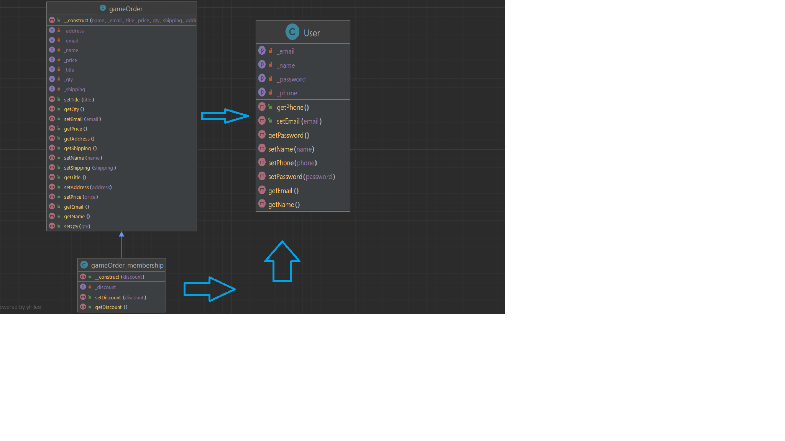
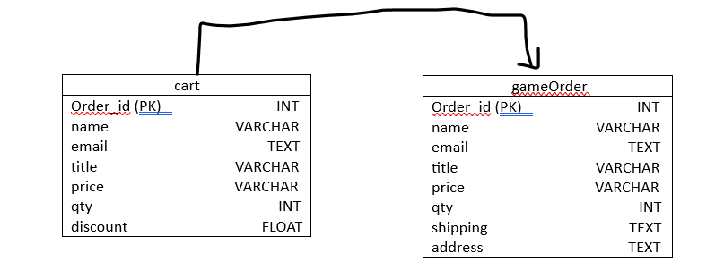

# gamewebsite
- a Website to help track games you've played as well as work as a storefront to sell you games you wish to play. It will also show reviews and other users thoughts on the games listed.
# Authors:
- Jeconiah Alferez-Ruiz, Ron Nguyen, Jerome Shadkim
# Project Requirements:
## [x] 1: Separates all database/business logic using the MVC pattern.
* The computer accesses controller.php to render pages and access the user database.
## [x] 2: Routes all URLs and leverages a templating language using the Fat-Free framework.
* We added routing to every page.
## [x] 3: Has a clearly defined database layer using PDO and prepared statements. 
* data-layer.php has PDO statements
## [x] 4: Data can be added and viewed.
* You can choose what game to add and how you want it to be shipped, as well as create an account to add info to our database.
## [x] 5: Has a history of commits from both team members to a Git repository. Commits are clearly commented.
* We will make sure all team members commit.
## [x] 6: Uses OOP, and utilizes multiple classes, including at least one inheritance relationship.
* The summary for orders as well as the cart is part of OOP, and members get a discount. That's inheritance.
## [x] 7: Contains full Docblocks for all PHP files and follows PEAR standards.
* We commented them all and attempted to follow PEAR standards
## [x] 8: Has full validation on the server side through PHP.
* validate.php 
## [x] 9: All code is clean, clear, and well-commented. DRY (Don't Repeat Yourself) is practiced.
-We did our best to keep things well commented.
## [x] 10: Your submission shows adequate effort for a final project in a full-stack web development course.
* We worked very hard on this.
# Your most current UML class diagram
- 
# You most current ER database diagram
- 
# Your admin login username and password, if applicable
* No username/password!